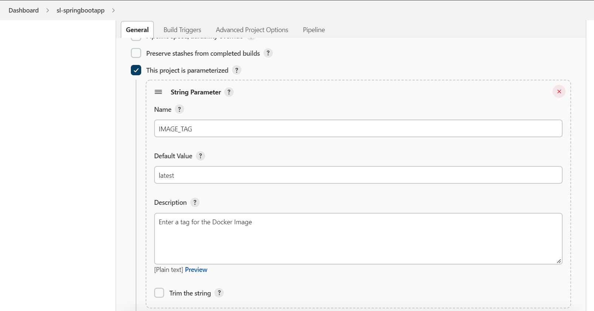

# Spring Boot Web App Deployment

## Build on AWS EC2

[How to Build](https://github.com/melvincv/springboot-crud-webapp/blob/master/notes/Build%20Instructions.pdf)

## Deploy on Docker

1. Create a file called .env from the given copy and fill in the variable values.
2. Check the Dockerfile and compose.yml file.
3. Run this to build the image and bring up the services (containers):

```
    docker compose up -d --build
```

4. Once you are done, run this to bring it down:

```
    docker compose down
```

## Push to Docker Hub using Jenkins

### Start a VM using **Ubuntu 20.04 LTS** image
### Install OpenJDK 11

```
sudo apt update
sudo apt install -y openjdk-11-jdk
```

---

### Install Jenkins on Ubuntu 20.04 LTS \
https://www.jenkins.io/doc/book/installing/linux/#debianubuntu

---

### Check whether Jenkins is started and enabled
```
sudo systemctl is-enabled jenkins
sudo systemctl status jenkins
```

### Get the initial admin password
```
sudo cat /var/lib/jenkins/secrets/initialAdminPassword
```

### Install Maven and Docker
```
sudo apt update
sudo apt install maven docker.io
sudo usermod -aG docker jenkins
mvn --version
java --version
```

### Manage Jenkins > Manage Plugins > Add Plugins 
- Maven integration
- Docker Pipeline

### Manage Jenkins > Global Tool Configuration: add jdk and maven with paths... \
You can get the paths from `mvn --version`

### Add Docker Hub Credentials
ID: docker_hub_login

### Change Docker Image name
Replace `melvincv/springbootcrudapp` in your Jenkinsfile

### Check Jenkinsfile

### Commit and Push to your repo

### Create a new Pipeline
- Configure > Pipeline > Pipeline script from SCM > Git > Paste git repo HTTPS clone URL

### Build with Parameters

- Add Parameters to the Configure page
    - String: MYSQL_DATABASE
    - String: MYSQL_USER
    - Password: MYSQL_PASSWORD



- Build with parameters
    - Enter a image tag
    - Tick DOCKER_BUILD if needed

# References

Spring Boot CRUD Web application with Pagination and Sorting features using Spring Boot, ThymeLeaf, Spring Data JPA, Hibernate, MySQL database

### Tutorial - Spring Boot CRUD Web Application with Thymeleaf, Spring MVC, Spring Data JPA, Hibernate, MySQL
https://www.javaguides.net/2020/05/spring-boot-crud-web-application-with-thymeleaf.html

### YouTube Video - Spring Boot CRUD Web Application with Thymeleaf, Spring MVC, Spring Data JPA, Hibernate, MySQL
https://youtu.be/_5sAmaRJd2c

### Tutorial - Pagination and Sorting with Spring Boot, ThymeLeaf, Spring Data JPA, Hibernate, MySQL
https://www.javaguides.net/2020/06/pagination-and-sorting-with-spring-boot-thymeleaf-spring-data-jpa-hibernate-mysql.html

### YouTube Video  - Pagination and Sorting with Spring Boot, ThymeLeaf, Spring Data JPA, Hibernate, MySQL
=> https://youtu.be/Aie8n12EFQc
